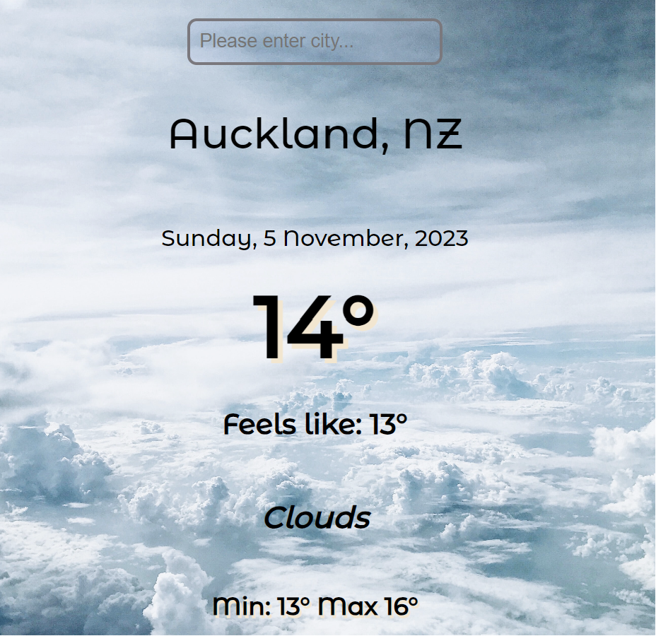

<h1 align="center"><a href="https://api-global-weather.netlify.app/"><strong>Global Weather App</strong></a></h1>
<p align="center">
    
</p>

## About
Global Weather App, a simple and intuitive weather application powered by the OpenWeatherMap API. This project allows users to retrieve real-time weather information for any city around the world.

## Features 
* __User-Friendly Interface__: Clean and straightforward design for easy navigation.
* __Real-Time Data__: Utilizes the OpenWeatherMap API to fetch up-to-date weather information.
* __Responsive Design__: Ensures a seamless experience on various devices.

## Technologies used:


## How to use
1. Enter the desired city in the input field.
2. Press "Enter" to fetch the weather details.
3. Explore temperature, conditions, and more for the specified location.

Feel free to explore the app and stay informed about the weather conditions worldwide.

## Installation
1. Ensure you have a modern web browser installed, such as Google Chrome, Mozilla Firefox, or Safari.
2. Clone the project repository to your local machine using the following command:

```bash
# Clone this repository
$ git clone https://github.com/lucid-dreamer11/weather-app

# Go into the repository
$ cd weather-app

# Open in browser
$ Open the index.html file in your preferred web browser by right-clicking on the file and selecting "Copy path" and pasting in browser.

```
## Acknowledgements 
Thanking Alla's CanSheCode programming school for the inspiration with this study project. 